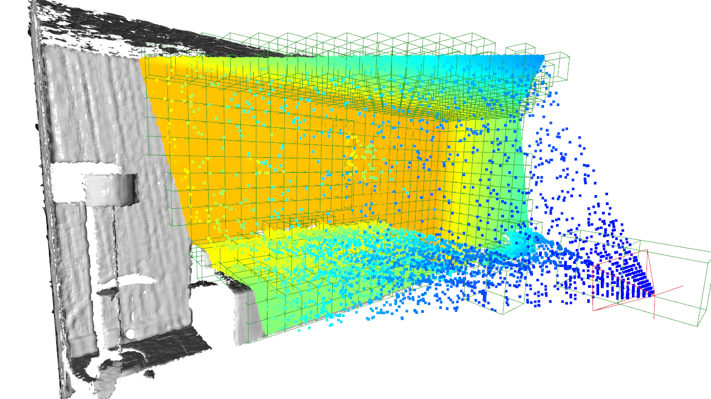
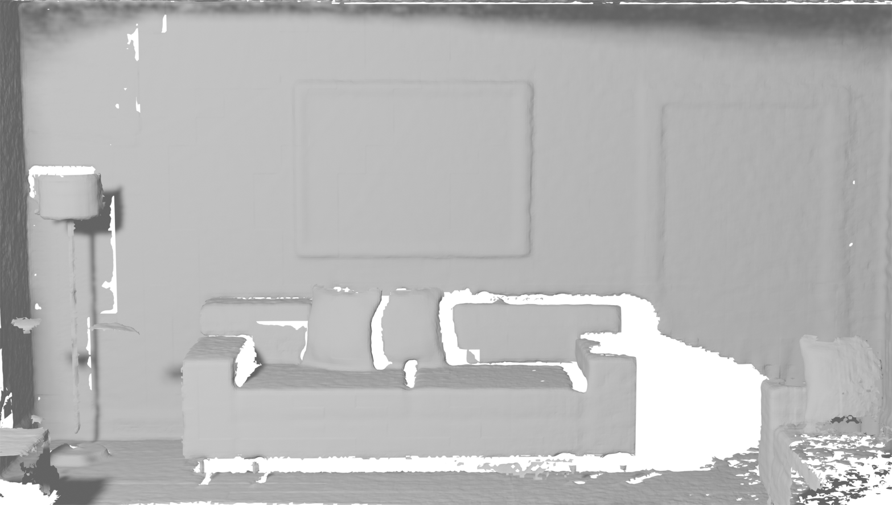
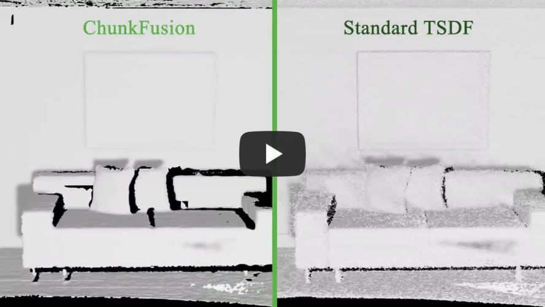
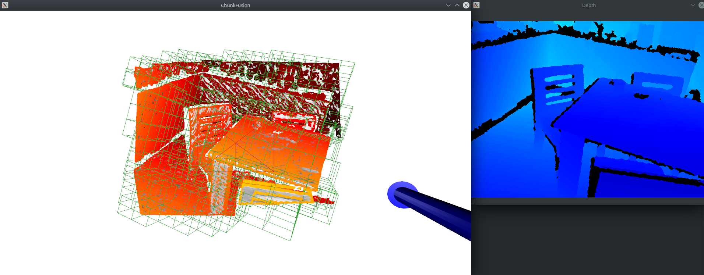

# ChunkFusion

Repository for paper "**ChunkFusion: A Learning-based RGB-D 3D Reconstruction Framework via Chunk-wise Integration**".  

<p float="left">
 
 
</p>

[](https://youtu.be/JZbxMzHp7uc "ChunkFusion")

## Prerequisites

ChunkFusion is based on Python 3.7 and implemented with PyTorch with CUDA 11. You can create the Python environment with necessary package using the `environment.yml`.

```
conda env create -f environment.yml
conda activate ChunkFusion
```

The fusion network is based on [spconv v1.2.1](https://github.com/traveller59/spconv/tree/v1.2.1), follow the installation instruction and install `spconv`.

## Demo

### Download sample data

Download the sample data from [here](https://drive.google.com/file/d/1RiabegvX_jo03dXyt6kXPxx0maWqz1TQ/view?usp=sharing) and place the extracted file in folder `./data`.


### Run the demo

Simply run `demo.py` to start the ChunkFusion pipeline:
```
python demo.py
```

When the window prompt, press `.` to start the reconstruction. Press again to pause. Press `S` to save current mesh model. Press `F` to toggle free viewport mode.



For more configuration of the reconstruction pipeline or changing the input data, you can edit `configs/demo.yaml`, where the parameter of voxel management and visualization are specified.

## Training the Fusion Network

### Data Generation

The implicit fusion network is trained on [ModelNet](https://modelnet.cs.princeton.edu/) dataset. To train our fusion network, we have to convert the mesh model in ModelNet into voxelized model and generate corresponding depth scans.

We provide a sample of ModelNet data for simple demonstration, [download](https://drive.google.com/file/d/10kJw6m-QnhBPqcBbUrb8mkgaHUDMqJM8/view?usp=sharing) and put the extracted folder in `./data`. If you want to train with your own data, you can refer to this sample data to format your data.

#### 1. Generate SDF Voxel  

```
python preprocess/generate_SDF.py --data_list_dir=data/ModelNet_sample/
```

We use the method in [mesh_to_sdf](https://github.com/marian42/mesh_to_sdf) to generate SDF values from triangle meshes. 

You can change the chunk size and voxel resolution by specifying `--chunk_size` and `--voxel_resolution`, which are set to 16 and 0.01 respectively.

It might take some time to generate the voxelized model, according to the size of input model and the resolution of voxel. The generated voxel SDF will be saved as a 3D numpy array.


#### 2. Generate Depth Image  

```
python preprocess/generate_depth_image.py --data_dir=data/ModelNet_sample
```
The depth images are generated using pyrender. The depth-dependent noise model in [simkinect](https://github.com/ankurhanda/simkinect) is adopted to mimic real-world depth sensor.

Depth frame as well as the corresponding camera pose will be saved in `scan` folder.

#### 3. Generate Chunk Data Sample  

Extract chunk-wise data from depth images for training and validating respectively.

```
python preprocess/generate_chunk.py --data_dir=data/ModelNet_sample/ --out_dir=data/ModelNet_sample/parser_data/train
python preprocess/generate_chunk.py --data_dir=data/ModelNet_sample/ --out_dir=data/ModelNet_sample/parser_data/val
```


### Train the Parser

The parser module of the fusion network has to be pre-trained individually.

```
python train_parser.py
```

Checkpoints will be saved in `checkpoints`. 
Edit `configs/train_parser.yaml` to tune the parameter of training.

### Train the Fuser

With the pre-trained parser module, we can now further train the fuser module.

#### 1. Generate Chunk Fusing Data Sample

To train the fuser module, we need a pair of TSDF data that containing the historical TSDF data and new incoming TSDF data respectively.
For each pair of fusing data, we use a voxel chunk generated from the parser module as the historical state and use a raw TSDF voxel chunk as the new measurement to be fused. 

Specify the pre-trained parser model path with `--parser_model` and run:

```
python preprocess/generate_fuse_chunk.py --data_dir=data/ModelNet_sample/ --parser_model=<checkpoints/parser/**/best_model.pth> --out_dir=data/ModelNet_sample/fuser_data/train
python preprocess/generate_fuse_chunk.py --data_dir=data/ModelNet_sample/ --parser_model=<checkpoints/parser/**/best_model.pth> --out_dir=data/ModelNet_sample/fuser_data/val
```

#### 2. Train the Fuser

With the fusing date, we can now train the fuser module.
Set the path to the pre-trained parser model in `configs/train_fuser.yaml` to further fine-tune the parser module.

```
python train_fuser.py
```

Checkpoints will be saved in `checkpoints`. 
Edit `configs/train_fuser.yaml` to tune the parameter of training.

### Note  
Here we just provide a simple sample on how to generate data and train the entire fusion net, which do not guarantee an exact same result in the paper. We provide the pre-trained model used in our paper in `pretrained/fuser.pth` and `pretrained/parser.pth`.


 
